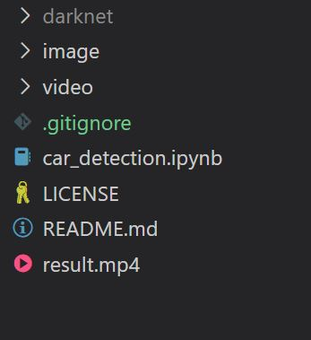
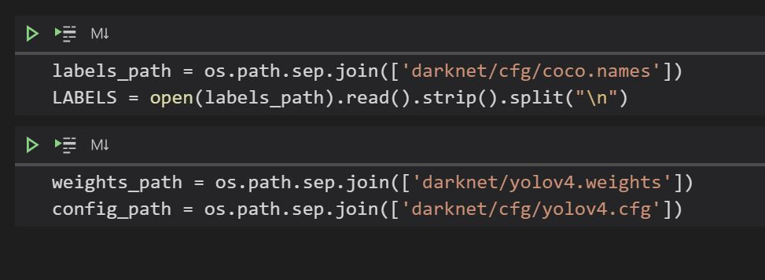

# This application was developed to detect cars in Forza Horizon 4 gameplay video

## Results of the the application using Yolo V4

Original video: https://www.youtube.com/watch?v=qPFYkgxRFBo
 
 

# Darknet #
Darknet is an open source neural network framework written in C and CUDA. It is fast, easy to install, and supports CPU and GPU computation.

# Yolo V4 #

You only look once (YOLO) is a family of one-stage object detectors that are fast and accurate. 

## Scaled-YOLOv4: 

* **paper:** https://arxiv.org/abs/2011.08036

* **source code - Darknet:** https://github.com/AlexeyAB/darknet

* **Medium:** https://alexeyab84.medium.com/scaled-yolo-v4-is-the-best-neural-network-for-object-detection-on-ms-coco-dataset-39dfa22fa982?source=friends_link&sk=c8553bfed861b1a7932f739d26f487c8

## YOLOv4:

* **paper:** https://arxiv.org/abs/2004.10934

* **source code:** https://github.com/AlexeyAB/darknet

* **Wiki:** https://github.com/AlexeyAB/darknet/wiki

For more information see the [Darknet project website](http://pjreddie.com/darknet).

___

A similar structure like the image below should be created, the darknet repository can be cloned using the link indicated above.

The Yolo V4 weights are available in the link below:

https://github.com/AlexeyAB/darknet/releases/download/darknet_yolo_v3_optimal/yolov4.weights

 

___
The files coco.names, yolov4.cfg and yolov4.weights need to be saved inside the darknet folder or in any other location and indicated in the python notebook car_detection.ipynb

___
Requirements:

- Matplotlib `pip install matplotlib`
- Numpy `pip install numpy`
- OpenCV `pip install opencv-python`
- Contrib `pip install opencv-contrib-python`
- Darknet 
___

 
In case of any questions, please contact me: edson.costa@hotmail.com